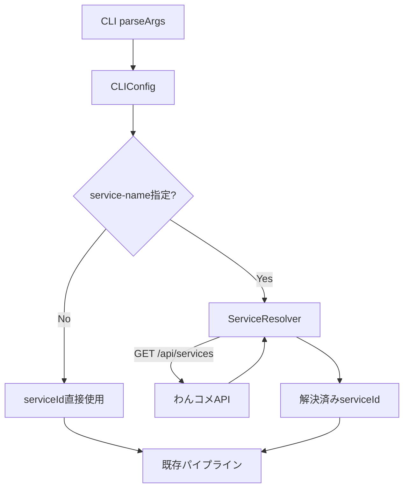
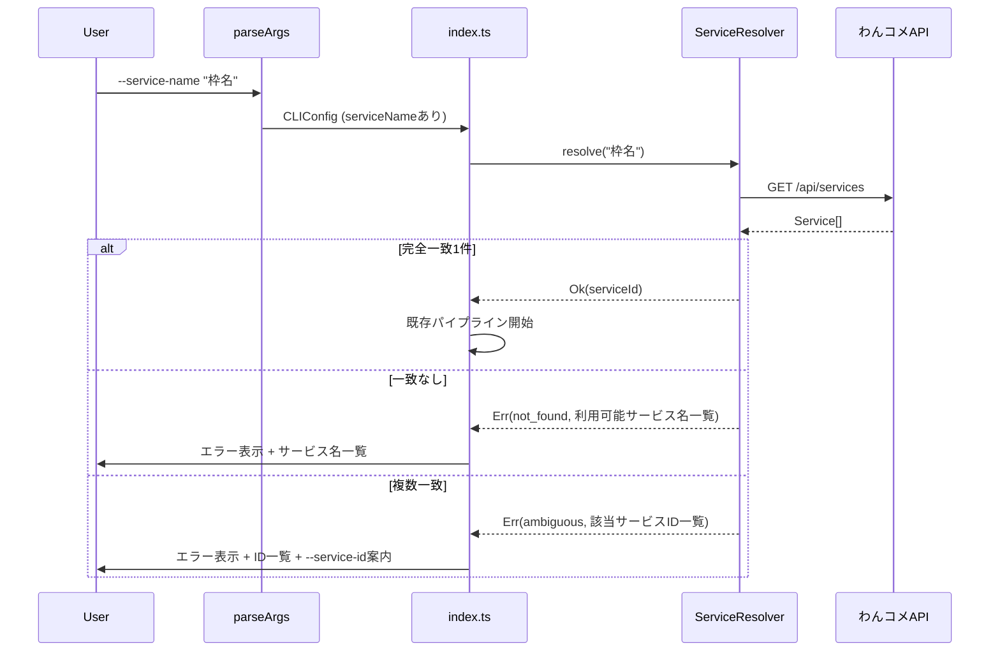

# Design Document

## Overview

**Purpose**: `--service-name` CLIオプションにより、ユーザーがわんコメの枠名を指定するだけでサービスIDを自動解決する機能を提供する。
**Users**: X Live配信者が、CLI起動時のサービスID調査・入力の手間を省くために使用する。
**Impact**: 既存の `--service-id` オプションを補完する形で新オプションを追加。既存動作に影響なし。

### Goals
- 枠の表示名からサービスIDを自動解決し、CLI操作を簡素化する
- `--service-id` との後方互換性を維持する
- 解決失敗時に利用可能なサービス名一覧を表示し、ユーザーの自己解決を支援する

### Non-Goals
- 部分一致・あいまい検索による名前解決
- わんコメ未起動時の自動リトライ・待機
- サービス名のキャッシュや永続化

## Architecture

### Existing Architecture Analysis

現在のアーキテクチャはパイプライン型で、CLIエントリーポイント（`index.ts`）が各コンポーネントを順序立てて初期化・実行する。

- `parseArgs()` → `CLIConfig` → `createBroadcastResolver()` → `createOneCommeClient()` → ポーリング開始
- `CLIConfig.oneCommeServiceId` は `parseArgs()` で確定し、以降のパイプラインにそのまま渡される
- サービスID解決ステップの挿入ポイント: `parseArgs()` の後、`createOneCommeClient()` の前

### Architecture Pattern & Boundary Map



**Architecture Integration**:
- Selected pattern: 既存パイプラインへの1ステップ挿入（起動時1回解決）
- Domain boundaries: ServiceResolverはわんコメAPI通信のみ担当。CLI解析・コメント送信には関与しない
- Existing patterns preserved: ファクトリ関数パターン、fetch DI、Result型エラーハンドリング
- New components rationale: `service-resolver.ts` — わんコメAPIからのサービス名解決ロジックを分離し、単体テストを可能にする
- Steering compliance: フラット構成、ファクトリ関数、Result型、ゼロ依存を維持

### Technology Stack

| Layer | Choice / Version | Role in Feature | Notes |
|-------|------------------|-----------------|-------|
| CLI | TypeScript + Node.js 18+ | CLI引数解析の拡張 | 既存と同一 |
| Backend / Services | Node.js標準 `fetch` | わんコメ `GET /api/services` 呼び出し | 新規依存なし |

## System Flows



## Requirements Traceability

| Requirement | Summary | Components | Interfaces | Flows |
|-------------|---------|------------|------------|-------|
| 1.1 | `--service-name` オプション受付 | CLIConfig | `parseArgs()` | - |
| 1.2 | サービスID自動解決の実行 | ServiceResolver, index.ts | `resolve()` | サービス解決フロー |
| 1.3 | `--service-id` と `--service-name` の排他 | CLIConfig | `parseArgs()` | - |
| 1.4 | 両方未指定時のエラー | CLIConfig | `parseArgs()` | - |
| 2.1 | GET /api/services 呼び出し | ServiceResolver | `resolve()` | サービス解決フロー |
| 2.2 | 完全一致1件でID採用 | ServiceResolver | `resolve()` | サービス解決フロー |
| 2.3 | 不一致時エラーとサービス名一覧表示 | ServiceResolver, index.ts | `resolve()`, `formatServiceResolveError()` | サービス解決フロー |
| 2.4 | 複数一致時エラーとID一覧表示 | ServiceResolver, index.ts | `resolve()`, `formatServiceResolveError()` | サービス解決フロー |
| 3.1 | 接続拒否時エラーメッセージ | ServiceResolver, index.ts | `resolve()`, `formatServiceResolveError()` | - |
| 3.2 | タイムアウト時エラーメッセージ | ServiceResolver, index.ts | `resolve()`, `formatServiceResolveError()` | - |
| 3.3 | APIエラー時エラーメッセージ | ServiceResolver, index.ts | `resolve()`, `formatServiceResolveError()` | - |
| 4.1 | `--service-id` 継続サポート | CLIConfig | `parseArgs()` | - |
| 4.2 | `--service-id` 時はAPI呼び出し不要 | index.ts | - | 分岐フロー |
| 4.3 | ヘルプメッセージ更新 | CLIConfig | `formatConfigError()` | - |

## Components and Interfaces

| Component | Domain/Layer | Intent | Req Coverage | Key Dependencies | Contracts |
|-----------|--------------|--------|--------------|------------------|-----------|
| CLIConfig拡張 | CLI | `--service-name` オプション追加と排他バリデーション | 1.1, 1.2, 1.3, 1.4, 4.1, 4.3 | なし | Service |
| ServiceResolver | わんコメ連携 | 枠名からサービスIDを解決 | 2.1, 2.2, 2.3, 2.4, 3.1, 3.2, 3.3 | わんコメAPI (P0) | Service, API |
| index.ts拡張 | エントリーポイント | サービス解決ステップの挿入とエラーハンドリング | 1.2, 4.2 | ServiceResolver (P0), CLIConfig (P0) | - |

### CLI Layer

#### CLIConfig拡張

| Field | Detail |
|-------|--------|
| Intent | `--service-name` オプションの追加と `--service-id` との排他制御 |
| Requirements | 1.1, 1.2, 1.3, 1.4, 4.1, 4.3 |

**Responsibilities & Constraints**
- `--service-name <名前>` オプションの解析
- `--service-id` と `--service-name` の排他バリデーション（両方指定→エラー、両方未指定→エラー）
- ヘルプメッセージ（usage）の更新

**Dependencies**
- Inbound: なし
- Outbound: なし

**Contracts**: Service [x]

##### Service Interface

`CLIConfig` 型の変更:

```typescript
/** サービス指定方法を表すdiscriminated union */
type ServiceTarget =
  | { kind: "id"; serviceId: string }
  | { kind: "name"; serviceName: string };

interface CLIConfig {
  broadcastUrl: string;
  oneCommeHost: string;
  oneCommePort: number;
  serviceTarget: ServiceTarget;  // oneCommeServiceId を置換
  pollIntervalMs: number;
  viewerCountPort: number;
}
```

`ConfigError` 型の拡張:

```typescript
type ConfigError =
  | { kind: "missing_broadcast_url" }
  | { kind: "missing_service_target" }        // missing_service_id を置換
  | { kind: "conflicting_service_options" }    // 新規: 両方指定エラー
  | { kind: "invalid_url"; url: string }
  | { kind: "invalid_port"; port: string }
  | { kind: "invalid_viewer_port"; port: string };
```

- Preconditions: `process.argv` が渡される
- Postconditions: `ServiceTarget` は `kind: "id"` または `kind: "name"` のいずれか1つ
- Invariants: `--service-id` と `--service-name` は同時に指定不可

**Implementation Notes**
- `parseArgs()` 内のforループに `--service-name` の分岐を追加
- `formatConfigError()` に新エラーkindのメッセージを追加
- usageメッセージを `--service-name <名前> | --service-id <id>` に更新

### わんコメ連携 Layer

#### ServiceResolver

| Field | Detail |
|-------|--------|
| Intent | わんコメAPI `GET /api/services` を呼び出し、枠名からサービスIDを解決する |
| Requirements | 2.1, 2.2, 2.3, 2.4, 3.1, 3.2, 3.3 |

**Responsibilities & Constraints**
- わんコメ `GET /api/services` エンドポイントの呼び出し
- レスポンス（`Service[]`）から指定名の完全一致検索
- 一致結果に応じた `Result<string, ServiceResolveError>` の返却

**Dependencies**
- Inbound: index.ts — サービス名解決呼び出し (P0)
- Outbound: なし
- External: わんコメAPI `GET /api/services` (P0)

**Contracts**: Service [x] / API [x]

##### Service Interface

```typescript
interface ServiceResolver {
  resolve(serviceName: string): Promise<Result<string, ServiceResolveError>>;
}

function createServiceResolver(
  config: { host: string; port: number },
  fetchFn?: typeof globalThis.fetch,
): ServiceResolver;
```

- Preconditions: `serviceName` は空文字列でない
- Postconditions: 成功時は解決済みのサービスID文字列を返す
- Invariants: 完全一致で1件のみヒットした場合にのみ成功を返す

##### API Contract

| Method | Endpoint | Request | Response | Errors |
|--------|----------|---------|----------|--------|
| GET | /api/services | なし | `Service[]` | 接続拒否, タイムアウト, 非2xx |

わんコメ `GET /api/services` レスポンス（名前解決に使用するフィールドのみ）:

```typescript
/** わんコメ GET /api/services レスポンスの各要素（必要フィールドのみ） */
interface OneCommeService {
  id: string;
  name: string;
}
```

**Implementation Notes**
- ファクトリ関数パターン `createServiceResolver()` で生成
- `fetchFn` パラメータでDI可能（テスト時にモック注入）
- レスポンスは `OneCommeService[]` として必要フィールドのみ使用し、他フィールドは無視

## Data Models

### Domain Model

#### ServiceResolveError（Discriminated Union）

```typescript
type ServiceResolveError =
  | { kind: "not_found"; serviceName: string; availableServices: string[] }
  | { kind: "ambiguous"; serviceName: string; matches: Array<{ id: string; name: string }> }
  | { kind: "connection_refused" }
  | { kind: "timeout" }
  | { kind: "api_error"; status: number; message: string };
```

- `not_found`: 指定名に完全一致するサービスなし。`availableServices` に利用可能なサービス名一覧を格納（2.3）
- `ambiguous`: 同名サービスが複数存在。`matches` に該当サービスのID・名前ペアを格納（2.4）
- `connection_refused`: わんコメAPIへの接続拒否（3.1）
- `timeout`: わんコメAPIタイムアウト（3.2）
- `api_error`: 2xx以外のレスポンス（3.3）

## Error Handling

### Error Strategy

既存プロジェクトのResult型パターンに従い、すべてのエラーは `Err<ServiceResolveError>` として返却する。例外は投げない。

### Error Categories and Responses

**ユーザーエラー**:
- `not_found` → 指定された名前と利用可能なサービス名一覧を表示
- `ambiguous` → 該当するサービスのID・名前一覧を表示し、`--service-id` での直接指定を案内

**システムエラー**:
- `connection_refused` → 「わんコメが起動しているか確認してください」のメッセージ
- `timeout` → 「わんコメAPIへの接続がタイムアウトしました」のメッセージ
- `api_error` → ステータスコードとレスポンス内容を表示

### エラーメッセージフォーマット関数

```typescript
function formatServiceResolveError(error: ServiceResolveError): string;
```

index.tsで使用し、エラー種別に応じたユーザー向けメッセージを生成する。

## Testing Strategy

### Unit Tests

- **service-resolver.test.ts**:
  - 完全一致1件 → `Ok(serviceId)` を返す
  - 一致なし → `Err({ kind: "not_found", availableServices: [...] })` を返す
  - 複数一致 → `Err({ kind: "ambiguous", matches: [...] })` を返す
  - 接続拒否 → `Err({ kind: "connection_refused" })` を返す
  - タイムアウト → `Err({ kind: "timeout" })` を返す
  - APIエラー（非2xx） → `Err({ kind: "api_error", ... })` を返す

- **cli-config.test.ts（拡張）**:
  - `--service-name` のパース成功
  - `--service-id` と `--service-name` 同時指定 → `conflicting_service_options` エラー
  - 両方未指定 → `missing_service_target` エラー
  - `--service-id` のみ指定 → 後方互換性（既存テストの `oneCommeServiceId` → `serviceTarget` 更新）
