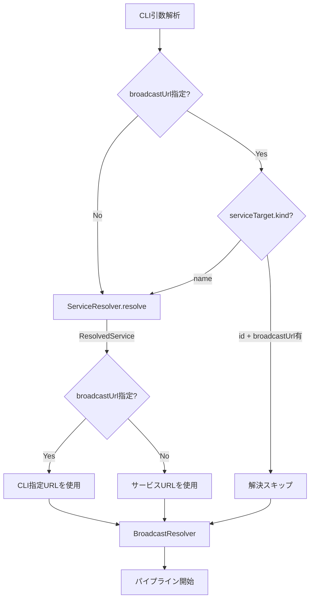
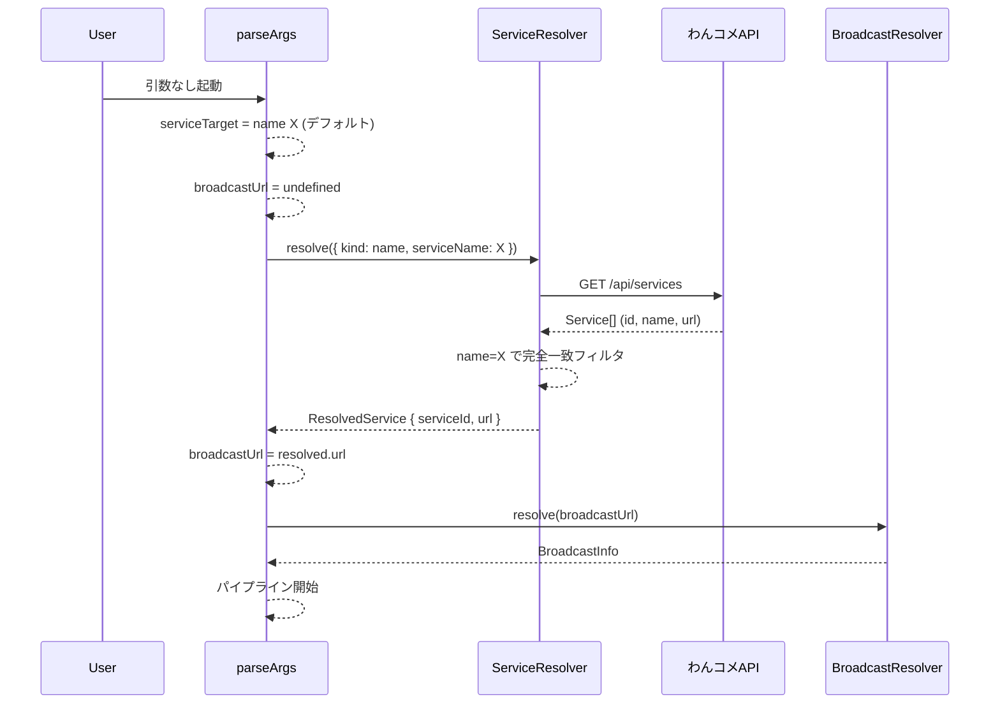

# 設計文書: wancome-auto-defaults

## 概要

**Purpose**: CLIツールの起動引数を大幅に簡略化し、引数なしでの起動を可能にする。
**Users**: X Liveで配信しながらわんコメを使うライブ配信者が、設定済みのわんコメ環境からゼロ引数で起動できるようになる。
**Impact**: `CLIConfig` の `broadcastUrl` と `serviceTarget` の必須制約を緩和し、`ServiceResolver` の入出力を拡張する。

### ゴール
- `--service-name` と `--service-id` の両方が省略された場合に `--service-name=X` をデフォルト適用
- `broadcast-url` 省略時にわんコメ `GET /api/services` から対象サービスのURLを自動取得
- 既存の明示的引数指定時の動作を変更しない（後方互換性維持）

### 非ゴール
- わんコメAPIのURL以外のフィールド（`enabled`、`meta` 等）の活用
- 実行中のサービスURL変更への動的追従
- わんコメ未起動時の自動リトライ・待機

## アーキテクチャ

### 既存アーキテクチャ分析

現在のCLI起動フロー:

1. `parseArgs()` — CLI引数解析（`broadcastUrl` 必須、`serviceTarget` 必須）
2. `ServiceResolver.resolve()` — 名前→ID解決（`kind=name` 時のみ）
3. `BroadcastResolver.resolve()` — ブロードキャスト情報取得
4. パイプライン開始

変更が必要な制約:
- `CLIConfig.broadcastUrl` が `string`（必須）
- `serviceTarget` が未指定時にエラー
- `ServiceResolver` が名前検索のみ、戻り値がIDのみ（`string`）

### アーキテクチャパターンと境界マップ



**アーキテクチャ統合**:
- 選択パターン: 既存のパイプライン型アーキテクチャを維持し、ServiceResolverの入出力を拡張
- 既存パターン維持: ファクトリ関数、Result型、fetch注入
- 新規コンポーネント: なし（既存コンポーネントの拡張のみ）

### テクノロジースタック

| レイヤー | 選択 / バージョン | 本機能での役割 | 備考 |
|---------|-----------------|--------------|------|
| CLI | Node.js標準 `process.argv` | 引数解析・デフォルト適用 | 変更なし |
| Backend / Services | Node.js標準 `fetch` | わんコメ `GET /api/services` 呼び出し | 変更なし |

## システムフロー

### broadcastUrl省略時の起動フロー



## 要件トレーサビリティ

| 要件 | 概要 | コンポーネント | インターフェース | フロー |
|------|------|-------------|----------------|--------|
| 1.1 | service-nameデフォルト=X | parseArgs | CLIConfig | CLI引数解析 |
| 1.2 | --service-name明示時はデフォルト不使用 | parseArgs | CLIConfig | CLI引数解析 |
| 1.3 | --service-id明示時はデフォルト不使用 | parseArgs | CLIConfig | CLI引数解析 |
| 2.1 | broadcastUrl省略時にAPI自動取得 | ServiceResolver, index.ts | ResolvedService | 起動フロー |
| 2.2 | broadcastUrl明示時はAPI不使用 | index.ts | — | 起動フロー |
| 2.3 | 自動取得URLをbroadcastUrlとして扱う | index.ts | CLIConfig | 起動フロー |
| 3.1 | API接続失敗時エラー | ServiceResolver | ServiceResolveError | エラーフロー |
| 3.2 | サービス未検出時エラー | ServiceResolver | ServiceResolveError | エラーフロー |
| 3.3 | URL未設定時エラー | ServiceResolver | ServiceResolveError | エラーフロー |

## コンポーネントとインターフェース

| コンポーネント | レイヤー | 意図 | 要件カバー | 主要依存 | コントラクト |
|--------------|---------|------|-----------|---------|------------|
| parseArgs | CLI | 引数解析・デフォルト適用 | 1.1, 1.2, 1.3 | extractBroadcastId (P1) | Service |
| ServiceResolver | Backend | サービス情報取得（名前/ID → serviceId + url） | 2.1, 3.1, 3.2, 3.3 | わんコメAPI (P0) | Service, API |
| index.ts (起動フロー) | Orchestration | broadcastUrl決定・フロー制御 | 2.1, 2.2, 2.3 | parseArgs (P0), ServiceResolver (P0) | — |

### CLI レイヤー

#### parseArgs

| フィールド | 詳細 |
|-----------|------|
| Intent | CLI引数を解析し、デフォルト値を適用して `CLIConfig` を返す |
| Requirements | 1.1, 1.2, 1.3 |

**責務と制約**
- `broadcastUrl` を必須からオプションに変更
- `serviceTarget` 未指定時に `{ kind: "name", serviceName: "X" }` をデフォルト適用
- `broadcastUrl` 指定時のみURL形式バリデーションを実行
- `--service-name` と `--service-id` 排他制約は維持

**コントラクト**: Service [x]

##### サービスインターフェース

```typescript
function parseArgs(argv: string[]): Result<CLIConfig, ConfigError>;
```

`CLIConfig` 型変更:

```typescript
interface CLIConfig {
  broadcastUrl: string | undefined; // was: string (required)
  oneCommeHost: string;
  oneCommePort: number;
  serviceTarget: ServiceTarget;
  pollIntervalMs: number;
  viewerCountPort: number;
}
```

`ConfigError` 型変更:

```typescript
type ConfigError =
  // | { kind: "missing_broadcast_url" }     // 削除
  // | { kind: "missing_service_target" }    // 削除
  | { kind: "conflicting_service_options" }
  | { kind: "invalid_url"; url: string }
  | { kind: "invalid_port"; port: string }
  | { kind: "invalid_viewer_port"; port: string };
```

- 前提条件: `argv` は `process.argv` 形式
- 事後条件: `broadcastUrl` が指定されている場合、`extractBroadcastId` バリデーション通過済み。未指定時は `undefined`
- 不変条件: `--service-name` と `--service-id` は同時指定不可

**実装メモ**
- USAGE文字列を更新: `<broadcast-url>` → `[broadcast-url]`、`--service-name | --service-id` → `[--service-name] [--service-id]`
- `formatConfigError` から削除されたエラー種別のcase分岐を除去

### Backend レイヤー

#### ServiceResolver

| フィールド | 詳細 |
|-----------|------|
| Intent | わんコメAPI `GET /api/services` を呼び出し、ServiceTargetからサービスIDとURLを解決する |
| Requirements | 2.1, 3.1, 3.2, 3.3 |

**責務と制約**
- `ServiceTarget`（name/id）を受け取り、対応するサービスのIDとURLを返す
- `kind=name` 時: 名前で完全一致フィルタ（既存ロジック）
- `kind=id` 時: IDで完全一致検索（新規）
- URLが空文字の場合、`url_not_found` エラーを返す

**依存**
- External: わんコメAPI `GET /api/services` (P0)

**コントラクト**: Service [x] / API [x]

##### サービスインターフェース

```typescript
interface ServiceResolver {
  resolve(target: ServiceTarget): Promise<Result<ResolvedService, ServiceResolveError>>;
}
```

新規戻り値型:

```typescript
interface ResolvedService {
  serviceId: string;
  url: string;
}
```

- 前提条件: わんコメが起動済みでAPIアクセス可能
- 事後条件: 返される `serviceId` は一意に特定されたサービスのID、`url` はそのサービスのURL（空でないことが保証される）
- 不変条件: API呼び出しは1回のみ（リクエスト重複なし）

##### APIコントラクト

| メソッド | エンドポイント | リクエスト | レスポンス | エラー |
|---------|-------------|---------|----------|--------|
| GET | /api/services | なし | `Service[]` | 接続拒否, タイムアウト, 非2xx |

##### `OneCommeService` 型拡張

```typescript
interface OneCommeService {
  id: string;
  name: string;
  url: string;  // 新規追加
}
```

##### `ServiceResolveError` 型拡張

```typescript
type ServiceResolveError =
  | { kind: "not_found"; serviceName: string; availableServices: string[] }
  | { kind: "id_not_found"; serviceId: string }                              // 新規
  | { kind: "url_not_found"; serviceId: string; serviceName: string }        // 新規
  | { kind: "ambiguous"; serviceName: string; matches: Array<{ id: string; name: string }> }
  | { kind: "connection_refused" }
  | { kind: "timeout" }
  | { kind: "api_error"; status: number; message: string };
```

**実装メモ**
- `resolve` メソッド内で `target.kind` に応じて分岐
- `kind=name` の既存ロジックを維持しつつ、戻り値にURLを含める
- `kind=id` は `services.find(s => s.id === target.serviceId)` で検索
- URLが空文字（`""`）の場合は `url_not_found` を返す
- `formatServiceResolveError` に新規エラー種別のメッセージを追加

### Orchestration レイヤー

#### index.ts 起動フロー変更

| フィールド | 詳細 |
|-----------|------|
| Intent | サービス解決結果に基づいてbroadcastUrlを決定し、パイプラインを起動する |
| Requirements | 2.1, 2.2, 2.3 |

**フロー決定ロジック**:

```
needsResolve = (serviceTarget.kind === "name") OR (broadcastUrl === undefined)

if needsResolve:
  resolved = await resolver.resolve(serviceTarget)
  serviceId = resolved.serviceId
  broadcastUrl = config.broadcastUrl ?? resolved.url
else:
  serviceId = serviceTarget.serviceId
  broadcastUrl = config.broadcastUrl  // 必ず存在する
```

**実装メモ**
- `broadcastUrl` 確定後に `extractBroadcastId` バリデーションを実行
- バリデーション失敗時は既存の `invalid_url` エラーと同等のメッセージを表示
- `logConfig` で自動取得されたURLであることを示す情報を出力

## エラーハンドリング

### エラー戦略

既存の `ServiceResolveError` パターンを拡張し、新規エラー種別を追加する。

### エラーカテゴリとレスポンス

| エラー種別 | 条件 | ユーザーメッセージ概要 | 要件 |
|-----------|------|---------------------|------|
| `connection_refused` | わんコメAPI接続失敗 | 接続先ホスト・ポートを含む案内 | 3.1 |
| `not_found` | 名前でサービス未検出 | 指定名と利用可能サービス一覧 | 3.2 |
| `id_not_found` | IDでサービス未検出 | 指定IDの案内 | 3.2 |
| `url_not_found` | サービス存在するがURL空 | URL未設定の旨と対処案 | 3.3 |

`formatServiceResolveError` に追加するメッセージ:
- `id_not_found`: `エラー: サービスID「{id}」に一致するサービスが見つかりません。`
- `url_not_found`: `エラー: サービス「{serviceName}」（ID: {serviceId}）にURLが設定されていません。わんコメで枠のURLを設定するか、broadcast-urlを直接指定してください。`

## テスト戦略

### 単体テスト

- **cli-config.test.ts**:
  - 引数なし時に `serviceTarget = { kind: "name", serviceName: "X" }` が設定される
  - 引数なし時に `broadcastUrl = undefined` になる
  - `--service-name` 明示時はデフォルト不使用
  - `--service-id` 明示時はデフォルト不使用
  - `broadcastUrl` 省略時にURL形式バリデーションをスキップ
  - `broadcastUrl` 指定時はURL形式バリデーションを実行

- **service-resolver.test.ts**:
  - `kind=name` の既存テスト全通過（戻り値型変更への適合）
  - `kind=id` でサービスIDを検索しResolvedServiceを返す
  - `kind=id` で未検出時に `id_not_found` エラー
  - URL空文字時に `url_not_found` エラー
  - `formatServiceResolveError` で新規エラーメッセージのフォーマット

### 統合テスト

- **引数なし起動**: わんコメAPIモックでService配列を返し、URL自動取得→ブロードキャスト解決の一連フローが成功
- **broadcastUrl明示 + service-nameデフォルト**: APIからURL不使用、サービス名解決のみ実行
- **わんコメ未起動時**: 接続拒否エラーが適切なメッセージで表示
