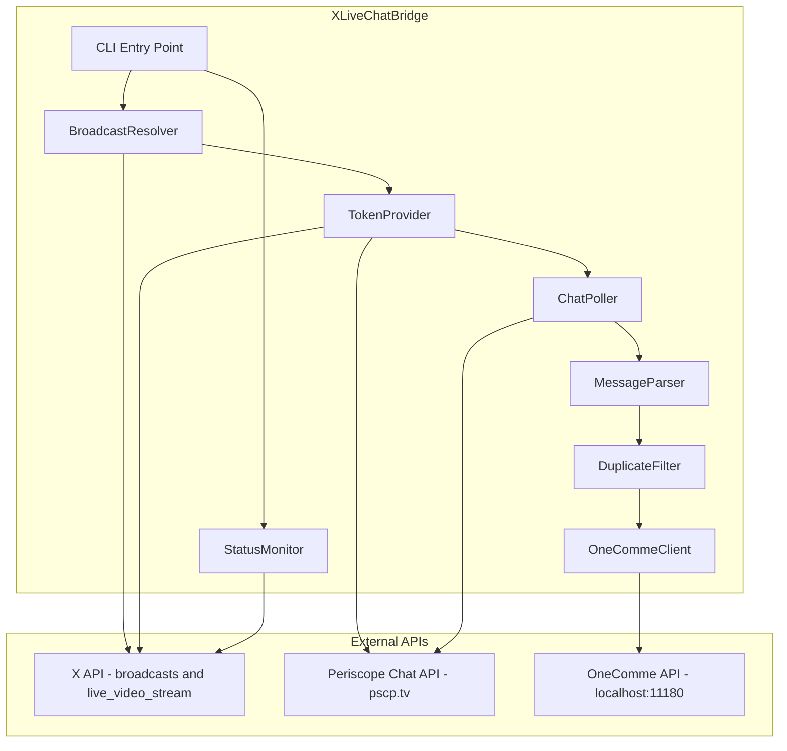
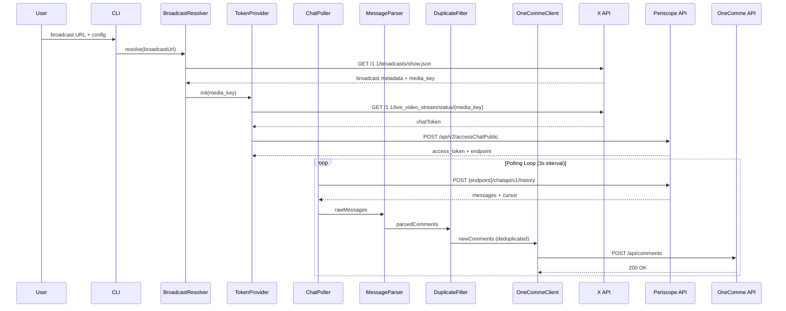
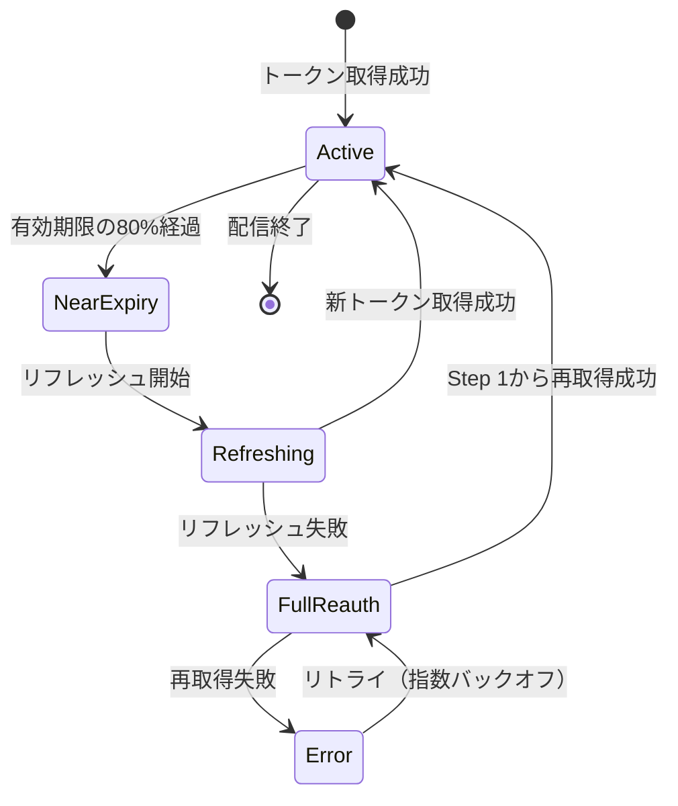
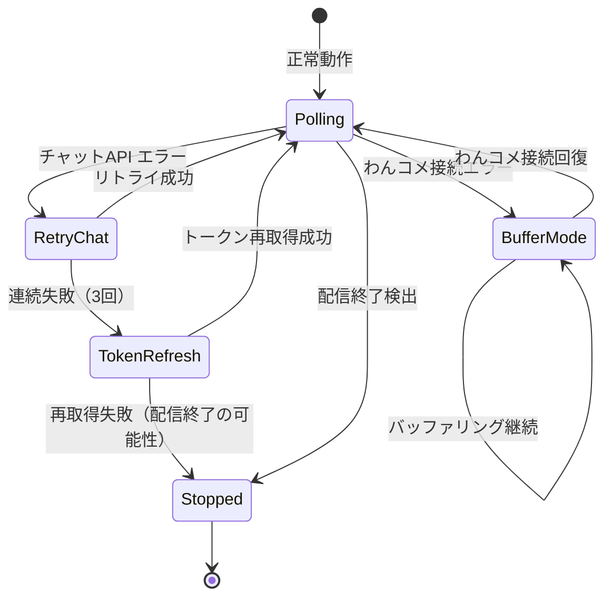
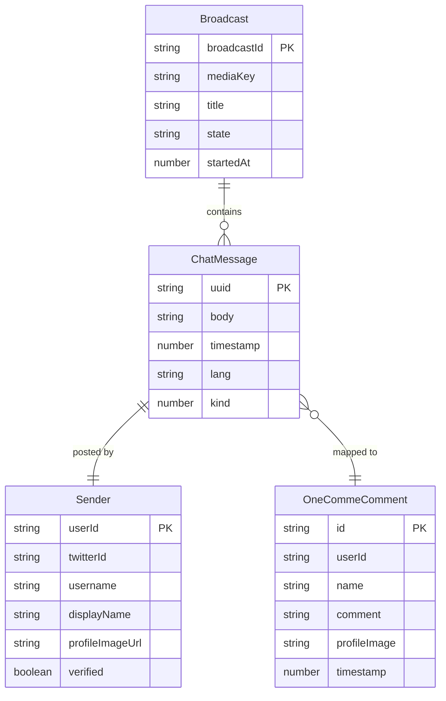

# Design Document: x-live-to-wancome

## Overview

**Purpose**: X（Twitter）ライブ配信のチャットコメントをリアルタイムで取得し、コメント管理アプリ「わんコメ」（OneComme）にブリッジするCLIアプリケーションを提供する。

**Users**: ライブ配信者が、XライブのコメントをわんコメのOBS連携・読み上げ・管理機能と統合するために使用する。

**Impact**: X Liveには公式チャットAPIがなく、わんコメも公式にはX Liveに対応していない。本ブリッジにより、配信者はX Liveコメントを他プラットフォームと同等に管理可能になる。

### Goals
- X Liveチャットの公開HTTPエンドポイント（Periscope Chat API）を利用したリアルタイムコメント取得
- わんコメ`POST /api/comments`へのシームレスなコメント転送
- 長時間配信に耐える安定した動作（トークンリフレッシュ、再接続、エラーリカバリ）

### Non-Goals
- X Liveへのコメント送信（読み取り専用）
- ブラウザ自動化によるコメント取得（HTTPポーリングで実現）
- 複数配信の同時監視
- GUIの提供（CLIアプリケーションとして提供）
- わんコメのサービスフレーム自動作成

## Architecture

> 詳細な調査結果は`research.md`に記録。本セクションではその結論に基づく設計判断を記載する。

### Architecture Pattern & Boundary Map

**選択パターン**: Pipeline（直列パイプライン）

X Liveチャットの取得は、ブロードキャスト解決→トークン取得→ポーリング→パース→重複フィルタ→送信という直列フローで構成される。単一配信監視というスコープに最適なパターンであり、各コンポーネントの責任が明確で、デバッグが容易。



**Key Decisions**:
- ブラウザ自動化ではなく、直接HTTP APIポーリングを採用（軽量・安定）
- Periscope Chat APIは公開エンドポイントとして認証なしでアクセス可能

### Technology Stack

| Layer | Choice / Version | Role in Feature | Notes |
|-------|------------------|-----------------|-------|
| CLI | Node.js >= 18 + TypeScript 5.x | アプリケーション本体 | 組み込みfetch API使用、外部HTTP依存なし |
| HTTP Client | Node.js built-in fetch | X API/Periscope API/OneComme APIとの通信 | Node 18+のネイティブfetch |
| Configuration | 環境変数 + コマンドライン引数 | 接続設定 | dotenv等のライブラリは使用しない |
| Logging | console (structured) | 動作状況の出力 | 外部ロガー不要 |
| Build | tsx (dev) / tsc (build) | TypeScript実行・ビルド | |

> 外部ライブラリ依存を最小化する設計。Node.js 18+のネイティブfetch APIで全HTTP通信を処理する。

## System Flows

### メインフロー: 起動からコメント転送まで



**Key Decisions**:
- ポーリング間隔はデフォルト3秒（設定変更可能）
- cursorベースのページネーションにより、前回取得位置から差分のみ取得
- 空レスポンス時もポーリングは継続（配信終了はStatusMonitorが別途検出）

### トークンリフレッシュフロー



### エラーリカバリフロー



## Requirements Traceability

| Requirement | Summary | Components | Interfaces | Flows |
|-------------|---------|------------|------------|-------|
| 1.1 | URL指定で取得開始 | CLI, BroadcastResolver | CLI引数パーサー | メインフロー |
| 1.2 | コメントデータ取得（テキスト、投稿者名等） | MessageParser | ChatMessage型 | メインフロー |
| 1.3 | 継続的なコメント監視 | ChatPoller | PollerConfig | ポーリングループ |
| 1.4 | 配信終了時の停止通知 | StatusMonitor | BroadcastState | - |
| 2.1 | わんコメへのPOST送信 | OneCommeClient | OneCommeComment型 | メインフロー |
| 2.2 | 送信データフィールドの完全性 | MessageParser, OneCommeClient | FieldMapping | メインフロー |
| 2.3 | 送信成功の記録 | DuplicateFilter | - | メインフロー |
| 2.4 | 送信失敗時のリトライ | OneCommeClient | RetryConfig | エラーリカバリフロー |
| 3.1 | XライブURL入力 | CLI | CLIConfig型 | メインフロー |
| 3.2 | わんコメホスト・ポート設定 | CLI | CLIConfig型 | - |
| 3.3 | わんコメ枠ID設定 | CLI | CLIConfig型 | - |
| 3.4 | 必須設定不足時の通知 | CLI | Validation | - |
| 4.1 | 接続切断時の自動再接続 | TokenProvider, ChatPoller | - | トークンリフレッシュ、エラーリカバリ |
| 4.2 | わんコメ接続不能時のバッファリング | OneCommeClient | CommentBuffer | エラーリカバリフロー |
| 4.3 | 動作状況ログ | 全コンポーネント | Logger | - |
| 4.4 | 予期しないエラーのハンドリング | 全コンポーネント | - | エラーリカバリフロー |
| 5.1 | 送信済みID記録と重複防止 | DuplicateFilter | Set of UUID | メインフロー |
| 5.2 | 再接続時の重複スキップ | DuplicateFilter, ChatPoller | cursor保持 | エラーリカバリフロー |

## Components and Interfaces

| Component | Domain/Layer | Intent | Req Coverage | Key Dependencies | Contracts |
|-----------|-------------|--------|--------------|------------------|-----------|
| CLI | Application | エントリーポイント、設定管理 | 3.1, 3.2, 3.3, 3.4 | BroadcastResolver (P0) | Service |
| BroadcastResolver | Infrastructure | ブロードキャストURL解決、メタデータ取得 | 1.1 | X API (P0) | Service |
| TokenProvider | Infrastructure | チャットトークンの取得・リフレッシュ管理 | 4.1 | X API (P0), Periscope API (P0) | Service, State |
| ChatPoller | Core | チャットメッセージのポーリング取得 | 1.3, 5.2 | Periscope API (P0), TokenProvider (P0) | Service, State |
| MessageParser | Core | メッセージの解析・変換 | 1.2, 2.2 | なし | Service |
| DuplicateFilter | Core | 重複コメントの検出・除外 | 5.1, 5.2 | なし | Service, State |
| OneCommeClient | Infrastructure | わんコメAPIへのコメント送信 | 2.1, 2.3, 2.4, 4.2 | OneComme API (P0) | Service, API |
| StatusMonitor | Infrastructure | 配信状態の監視・終了検出 | 1.4 | X API (P1) | Service |

### Application Layer

#### CLI

| Field | Detail |
|-------|--------|
| Intent | コマンドライン引数の解析、設定のバリデーション、アプリケーションライフサイクル管理 |
| Requirements | 3.1, 3.2, 3.3, 3.4 |

**Responsibilities & Constraints**
- コマンドライン引数と環境変数からの設定読み込み
- 必須パラメータのバリデーションとエラーメッセージ表示
- メインパイプラインの起動とグレースフルシャットダウン（SIGINT/SIGTERM）

**Dependencies**
- Outbound: BroadcastResolver — 起動時のブロードキャスト解決 (P0)
- Outbound: StatusMonitor — 配信状態監視の開始 (P1)

**Contracts**: Service [x]

##### Service Interface
```typescript
interface CLIConfig {
  broadcastUrl: string;       // Xライブ配信URL or ブロードキャストID
  oneCommeHost: string;       // デフォルト: "localhost"
  oneCommePort: number;       // デフォルト: 11180
  oneCommeServiceId: string;  // わんコメの枠ID (UUID)
  pollIntervalMs: number;     // デフォルト: 3000
}

interface CLIService {
  parseArgs(argv: string[]): Result<CLIConfig, ConfigError>;
  run(config: CLIConfig): Promise<void>;
  shutdown(): Promise<void>;
}

type ConfigError =
  | { kind: "missing_broadcast_url" }
  | { kind: "missing_service_id" }
  | { kind: "invalid_url"; url: string }
  | { kind: "invalid_port"; port: string };
```

**Implementation Notes**
- `process.argv`を直接パースし、外部CLIフレームワーク不使用
- SIGINT/SIGTERMでグレースフルシャットダウン（ポーリングループの安全な停止）

### Infrastructure Layer

#### BroadcastResolver

| Field | Detail |
|-------|--------|
| Intent | XライブURLからブロードキャストメタデータとmedia_keyを解決する |
| Requirements | 1.1 |

**Responsibilities & Constraints**
- URL文字列からブロードキャストIDを抽出（例: `1yKAPMPBOOzxb`）
- X API `broadcasts/show.json`からメタデータを取得
- 配信が存在しない・終了済みの場合のエラーハンドリング

**Dependencies**
- External: X API `GET /1.1/broadcasts/show.json` — メタデータ取得 (P0)

**Contracts**: Service [x]

##### Service Interface
```typescript
interface BroadcastInfo {
  broadcastId: string;
  mediaKey: string;
  title: string;
  state: "RUNNING" | "ENDED" | string;
  username: string;
  displayName: string;
  startedAt: number;         // epoch ms
}

interface BroadcastResolver {
  resolve(urlOrId: string): Promise<Result<BroadcastInfo, BroadcastError>>;
}

type BroadcastError =
  | { kind: "invalid_url"; url: string }
  | { kind: "not_found"; broadcastId: string }
  | { kind: "already_ended"; broadcastId: string }
  | { kind: "api_error"; status: number; message: string };
```

##### API Contract
| Method | Endpoint | Request | Response | Errors |
|--------|----------|---------|----------|--------|
| GET | `api.x.com/1.1/broadcasts/show.json?ids={id}&include_events=false` | Query: ids, include_events | BroadcastShowResponse | 404 |

**Implementation Notes**
- URL形式: `https://x.com/i/broadcasts/{id}` or `https://twitter.com/i/broadcasts/{id}` or 直接ID
- `broadcasts/show.json`はGraphQL BroadcastQueryのRESTフォールバックとして安定性が高い
- Guest tokenなしでもアクセス可能（ネットワーク解析で確認済み）

#### TokenProvider

| Field | Detail |
|-------|--------|
| Intent | チャットアクセスに必要なトークンの取得・更新・有効期限管理 |
| Requirements | 4.1 |

**Responsibilities & Constraints**
- `live_video_stream/status`からchatToken（JWT）を取得
- `accessChatPublic`でaccess_tokenに交換
- トークン有効期限の監視と自動リフレッシュ（expの80%経過時点）
- リフレッシュ失敗時のフルフロー再取得

**Dependencies**
- External: X API `GET /1.1/live_video_stream/status/{media_key}.json` — chatToken取得 (P0)
- External: Periscope API `POST proxsee-cf.pscp.tv/api/v2/accessChatPublic` — access_token交換 (P0)

**Contracts**: Service [x] / State [x]

##### Service Interface
```typescript
interface ChatCredentials {
  accessToken: string;
  endpoint: string;           // chatman server URL (region-specific)
  roomId: string;
  expiresAt: number;          // epoch ms (chatTokenのexp * 1000)
}

interface TokenProvider {
  acquire(mediaKey: string): Promise<Result<ChatCredentials, TokenError>>;
  refresh(): Promise<Result<ChatCredentials, TokenError>>;
  isExpiringSoon(): boolean;
}

type TokenError =
  | { kind: "stream_not_found"; mediaKey: string }
  | { kind: "stream_offline" }
  | { kind: "chat_access_denied" }
  | { kind: "api_error"; status: number; message: string };
```

##### State Management
- chatTokenのJWT `exp`フィールドからexpiresAtを算出
- 現在のaccess_tokenとendpointをインメモリで保持
- リフレッシュタイマーはポーリングループ内で毎回チェック（別スレッド不使用）

**Implementation Notes**
- chatTokenはJWT形式だが、検証は不要（サーバーサイドで検証される）
- access_tokenは不透明トークン（JWT非準拠）、期限はchatTokenに依存
- endpointはリージョン固有（例: `prod-chatman-ancillary-ap-northeast-1.pscp.tv`）で、accessChatPublicレスポンスから動的取得

### Core Layer

#### ChatPoller

| Field | Detail |
|-------|--------|
| Intent | Periscope Chat APIからチャットメッセージを定期ポーリングで取得する |
| Requirements | 1.3, 5.2 |

**Responsibilities & Constraints**
- cursorベースのページネーションで差分メッセージを取得
- ポーリング間隔の管理（デフォルト3秒）
- ポーリングループの開始・停止制御

**Dependencies**
- External: Periscope Chat API `POST {endpoint}/chatapi/v1/history` — メッセージ取得 (P0)
- Inbound: TokenProvider — 有効なaccess_tokenの提供 (P0)

**Contracts**: Service [x] / State [x]

##### Service Interface
```typescript
interface RawChatMessage {
  kind: number;              // 1=chat, 2=system
  payload: string;           // JSON string
  signature: string;
}

interface ChatHistoryResponse {
  messages: RawChatMessage[];
  cursor: string;
}

interface ChatPoller {
  start(credentials: ChatCredentials, onMessages: (msgs: RawChatMessage[]) => void): void;
  stop(): void;
  getCursor(): string;
}
```

##### API Contract
| Method | Endpoint | Request | Response | Errors |
|--------|----------|---------|----------|--------|
| POST | `{endpoint}/chatapi/v1/history` | `{ access_token, cursor, limit, since, quick_get }` | `{ messages[], cursor }` | 401 (token invalid), 429 (rate limit) |

##### State Management
- `cursor`: 最後に取得したメッセージの位置（起動時は空文字列 → 全履歴取得）
- ポーリングタイマーのID（停止用）

**Implementation Notes**
- `since`パラメータ: ナノ秒タイムスタンプ。初回は0（全履歴取得）、以降は不使用（cursorに依存）
- `limit`: 1000（1回あたりの最大取得件数）
- `quick_get`: false（通常モード）
- 空cursorが返却された場合は新規メッセージなし、次回ポーリングで前回のcursorを再利用

#### MessageParser

| Field | Detail |
|-------|--------|
| Intent | 二重ネストされたJSONペイロードをパースし、わんコメ形式に変換する |
| Requirements | 1.2, 2.2 |

**Responsibilities & Constraints**
- `kind: 1`（チャットメッセージ）のみを処理、`kind: 2`（システムイベント）はスキップ
- payloadの二段階JSONパース（payload → body）
- フィールドマッピング: X Liveフィールド → わんコメCommentフィールド

**Dependencies**
- なし（純粋な変換関数）

**Contracts**: Service [x]

##### Service Interface
```typescript
interface ParsedComment {
  id: string;                // payload.uuid
  userId: string;            // sender.twitter_id
  username: string;          // sender.username
  displayName: string;       // sender.display_name
  comment: string;           // body.body (inner JSON)
  profileImage: string;      // sender.profile_image_url
  timestamp: number;         // body.timestamp (ms)
  verified: boolean;         // sender.verified
  lang: string;              // payload.lang
}

interface MessageParser {
  parse(raw: RawChatMessage[]): ParsedComment[];
}
```

**Implementation Notes**
- フィールドマッピング:
  - `sender.display_name` → `comment.name`
  - `sender.twitter_id` → `comment.userId`
  - `sender.profile_image_url` → `comment.profileImage`（`_reasonably_small` サフィックスのまま使用）
  - `body.body`（内部JSON） → `comment.comment`
  - `payload.uuid` → `comment.id`
  - `body.timestamp`（ミリ秒） → `comment.timestamp`（number型のまま保持）
- payloadまたはbodyのJSONパースに失敗したメッセージはスキップし、ログに記録

#### DuplicateFilter

| Field | Detail |
|-------|--------|
| Intent | 送信済みコメントのUUIDを記録し、重複送信を防止する |
| Requirements | 5.1, 5.2 |

**Responsibilities & Constraints**
- UUIDベースのインメモリSetで重複検出（O(1)ルックアップ）
- 送信成功時にUUIDを記録
- メモリ上限管理（古いエントリの削除）

**Dependencies**
- なし

**Contracts**: Service [x] / State [x]

##### Service Interface
```typescript
interface DuplicateFilter {
  isDuplicate(commentId: string): boolean;
  markSent(commentId: string): void;
  size(): number;
}
```

##### State Management
- `Set<string>`: 送信済みUUIDの集合
- 最大サイズ: 10,000件（超過時はLRU的に古いエントリを削除）

### Infrastructure Layer (Outbound)

#### OneCommeClient

| Field | Detail |
|-------|--------|
| Intent | パース済みコメントをわんコメHTTP APIに送信する |
| Requirements | 2.1, 2.3, 2.4, 4.2 |

**Responsibilities & Constraints**
- `POST /api/comments`へのJSON送信
- 送信失敗時のリトライ（最大3回、指数バックオフ）
- わんコメ接続不能時のコメントバッファリング

**Dependencies**
- External: OneComme API `POST /api/comments` — コメント送信 (P0)

**Contracts**: Service [x] / API [x] / State [x]

##### Service Interface
```typescript
interface OneCommeComment {
  service: {
    id: string;              // わんコメの枠ID (UUID)
  };
  comment: {
    id: string;
    userId: string;
    name: string;
    comment: string;
    profileImage: string;
    badges: never[];
    hasGift: false;
    isOwner: boolean;
    timestamp: number;       // epoch ms (number) — わんコメAJVスキーマはoneOf[number, date-time string]
  };
}

interface OneCommeClient {
  send(comment: ParsedComment): Promise<Result<void, SendError>>;
  isConnected(): boolean;
  getBufferSize(): number;
  flushBuffer(): Promise<void>;
}

type SendError =
  | { kind: "connection_refused" }
  | { kind: "invalid_service_id"; serviceId: string }
  | { kind: "validation_error"; details: string }
  | { kind: "api_error"; status: number; message: string }
  | { kind: "timeout" };
```

##### API Contract
| Method | Endpoint | Request | Response | Errors |
|--------|----------|---------|----------|--------|
| POST | `http://{host}:{port}/api/comments` | OneCommeComment (JSON) | 200 OK | 400 (invalid service.id), ECONNREFUSED |

##### State Management
- 送信バッファ: `ParsedComment[]`（わんコメ接続不能時に蓄積、最大1,000件）
- 接続状態: connected / disconnected
- 接続回復時にバッファを順次送信（FIFO）

**Implementation Notes**
- `comment.timestamp`は`number`型（エポックミリ秒）でそのまま送信する。わんコメのAJVスキーマは`oneOf[number, date-time string]`で検証されるため、文字列化（`String()`）してはならない
- `badges`は空配列、`hasGift`はfalse固定
- `isOwner`は配信者のtwitter_idと一致する場合にtrueを設定
- リトライ間隔: 1秒、2秒、4秒（指数バックオフ）
- バッファが上限に達した場合、古いコメントを破棄
- 400レスポンスのハンドリング: レスポンスボディを解析し、`service.id`関連のエラーと`comment`フィールドのバリデーションエラーを区別する。レスポンスボディにAJVの`errors`配列が含まれる場合、`instancePath`で原因フィールドを特定できる

#### StatusMonitor

| Field | Detail |
|-------|--------|
| Intent | ブロードキャストの状態を定期監視し、配信終了を検出する |
| Requirements | 1.4 |

**Responsibilities & Constraints**
- `broadcasts/show.json`を定期ポーリング（30秒間隔）してstateフィールドを監視
- state: "RUNNING" → "ENDED"を検出してコールバック呼び出し

**Dependencies**
- External: X API `GET /1.1/broadcasts/show.json` — 配信状態取得 (P1)

**Contracts**: Service [x]

##### Service Interface
```typescript
type BroadcastState = "RUNNING" | "ENDED" | "TIMED_OUT" | string;

interface StatusMonitor {
  start(broadcastId: string, onStateChange: (state: BroadcastState) => void): void;
  stop(): void;
  getCurrentState(): BroadcastState;
}
```

**Implementation Notes**
- チャットポーリングとは独立した間隔（30秒）でチェック
- 配信終了検出後、ChatPollerに停止シグナルを送信

## Data Models

### Domain Model



### Data Contracts & Integration

**X Chat API → ParsedComment フィールドマッピング**

| X Chat API (source) | ParsedComment (internal) | OneComme API (target) |
|---------------------|--------------------------|----------------------|
| `payload.uuid` | `id` | `comment.id` |
| `sender.twitter_id` | `userId` | `comment.userId` |
| `sender.display_name` | `displayName` | `comment.name` |
| `body.body` (inner JSON) | `comment` | `comment.comment` |
| `sender.profile_image_url` | `profileImage` | `comment.profileImage` |
| `body.timestamp` (ms) | `timestamp` | `comment.timestamp` (number) |
| `sender.verified` | `verified` | — (マッピングなし) |

## Error Handling

### Error Strategy
全コンポーネントでResult型による明示的エラーハンドリングを採用する。例外（throw）は予期しないエラーにのみ使用し、トップレベルでキャッチしてログ出力後に動作を継続する。

### Error Categories and Responses

**ネットワークエラー**:
- X API接続失敗 → 指数バックオフでリトライ（最大5回）、全失敗時はトークンリフレッシュへエスカレート
- Periscope Chat API 401 → トークン再取得
- Periscope Chat API 429 → ポーリング間隔を2倍に延長、徐々に復帰

**アプリケーションエラー**:
- JSONパース失敗 → 該当メッセージをスキップ、ログ記録
- わんコメ接続拒否 → バッファモードに移行、30秒間隔で接続再試行
- わんコメ400 → レスポンスボディを解析し原因を特定:
  - service.id関連エラー → `invalid_service_id`としてユーザーに設定確認を促す
  - commentフィールドのバリデーションエラー → `validation_error`としてエラー詳細をログ出力

**致命的エラー**:
- ブロードキャスト未発見 → 即座に終了、ユーザーにURL確認を促す
- 全トークン再取得失敗 → ユーザーに通知して終了

### Monitoring
- 処理済みコメント数（累計・セッション）
- エラー発生数（カテゴリ別）
- ポーリングレイテンシ
- バッファサイズ（わんコメ接続不能時）
- すべてconsole出力（structured logging形式: `[timestamp] [level] [component] message`）

## Testing Strategy

### Unit Tests
- **MessageParser**: 二重ネストJSONの正常パース、不正JSON時のスキップ、kind:2メッセージのフィルタ
- **DuplicateFilter**: 新規ID判定、重複ID検出、サイズ上限時の古いエントリ削除
- **BroadcastResolver**: URL形式のバリエーション（x.com, twitter.com, 直接ID）からのbroadcastId抽出
- **CLIConfig**: 引数パース、デフォルト値適用、バリデーションエラー

### Integration Tests
- **TokenProvider**: chatToken取得→accessChatPublic→access_token取得のフルフロー（モックサーバー使用）
- **ChatPoller + MessageParser**: ポーリング→パース→コールバック呼び出しの結合テスト
- **OneCommeClient**: コメント送信→200 OK、接続拒否→バッファリング→回復→フラッシュ

### E2E Tests
- **フルパイプライン**: モックX API + モックOneComme APIで起動→コメント取得→変換→送信→重複スキップの一連フロー
- **グレースフルシャットダウン**: SIGINT送信→ポーリング停止→バッファフラッシュ→プロセス終了

## Optional Sections

### Security Considerations
- **API認証**: 現在の実装ではX API/Periscope Chat APIに認証なしでアクセス（ゲストアクセス）。将来的にAPIが認証を要求する可能性に備え、TokenProviderを拡張ポイントとして設計
- **ローカル通信**: わんコメAPIはlocalhost通信のみ。外部ネットワークへのコメントデータ送信は行わない
- **トークン管理**: chatToken/access_tokenはメモリ上にのみ保持し、ファイルやログに出力しない

### Performance & Scalability
- **メモリ使用量**: DuplicateFilterのSet上限10,000件（約500KB）+ 送信バッファ上限1,000件（約200KB）で合計1MB未満
- **CPU使用率**: 3秒間隔のHTTPポーリング + JSONパースのみ、CPU負荷は極めて低い
- **ネットワーク帯域**: chatapi/v1/historyリクエスト/レスポンスは数KB/回、3秒間隔で約1KB/s
