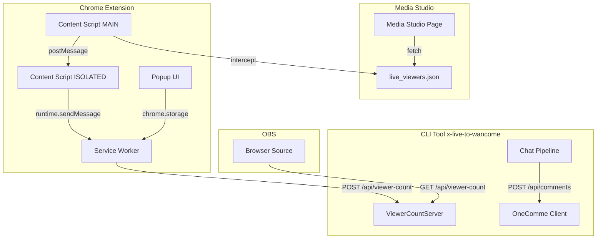
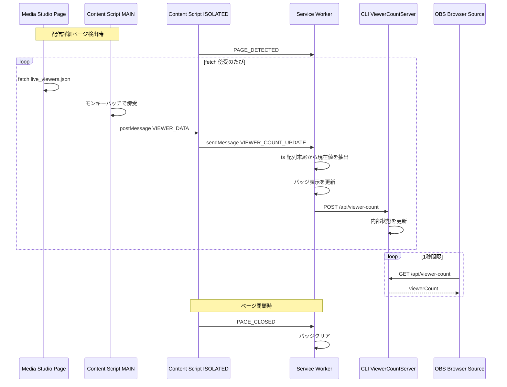
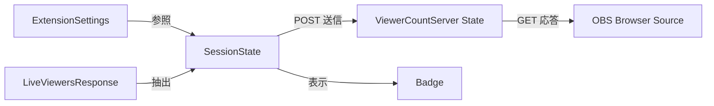

# 技術設計書

## Overview

**Purpose**: X Live の同時視聴者数を Chrome Extension で取得し、CLIツール（x-live-to-wancome）に統合したHTTPサーバー経由で OBS から取得可能にする。

**Users**: X Live で配信を行いながら OBS でオーバーレイ表示をする配信者が、Media Studio ページを開くだけで同時視聴者数を自動取得し、OBS ブラウザソースから1秒間隔でポーリングして配信画面に表示できる。

**Impact**: 当初のわんコメ Services API 経由の視聴者数送信は `meta` フィールドが内部管理であり外部書き込みがUIに反映されないことが判明したため、CLIツールにHTTPサーバーを統合し、Extension → CLIサーバー → OBS の新しいデータフローを構築する。

### Goals

- CLIツールに視聴者数HTTPサーバーを統合し、既存のチャット転送と並行稼働させる
- Chrome Extension が取得した同時視聴者数を CLIサーバーに HTTP POST で送信する
- OBS ブラウザソースから GET リクエストで視聴者数を1秒間隔でポーリング可能にする
- 既存の CLI チャット転送機能に影響を与えない

### Non-Goals

- わんコメ Services API 経由の視聴者数送信（技術的に不可能と判明）
- OBS WebSocket プロトコルとの直接統合
- 視聴者数のグラフ化・履歴表示
- 複数配信の同時視聴者数管理

## Architecture

### Existing Architecture Analysis

既存 CLI ツールはパイプライン型アーキテクチャで `src/` 直下にファクトリ関数ベースのコンポーネントをフラット配置している。ゼロ依存ポリシーに従い、Node.js 標準 API のみを使用する。新しい HTTPサーバーコンポーネントは `node:http` 標準モジュールを使用し、ゼロ依存を維持する。

既存 Extension は3層メッセージパッシングアーキテクチャ（MAIN world → ISOLATED world → Service Worker）で視聴者数を取得している。送信先を旧わんコメ API から CLIサーバーに変更する。

### Architecture Pattern & Boundary Map



**Architecture Integration**:

- **Selected pattern**: CLIプロセス内にHTTPサーバーを並行起動する。既存のチャットパイプラインとは独立したコンポーネントとして追加し、`index.ts` で初期化・統合する
- **Domain boundaries**: ViewerCountServer は視聴者数の受信・保持・配信のみを担当。チャットポーリング・わんコメ転送とは完全に独立
- **Existing patterns preserved**: ファクトリ関数パターン（`createViewerCountServer`）、Result 型、kebab-case ファイル命名、fetch 注入、createLogger
- **New components rationale**: CLI側は `viewer-count-server.ts`（HTTPサーバー）1ファイルのみ追加。Extension側は `wancomme-client.ts` を `viewer-count-client.ts` に置換
- **Steering compliance**: ゼロ依存（`node:http` は標準モジュール）、TypeScript strict mode

### Technology Stack

| Layer | Choice / Version | Role in Feature | Notes |
|-------|------------------|-----------------|-------|
| CLI HTTPサーバー | `node:http`（Node.js 18+ 標準） | 視聴者数の受信・配信 | ゼロ依存ポリシー維持 |
| Extension Runtime | Chrome Extension MV3 | 視聴者数の取得・送信 | 既存アーキテクチャ維持 |
| Language | TypeScript 5.x (strict) | CLI・Extension 両方 | 既存と同一 |
| Build (CLI) | tsc | TypeScript → JS | 既存と同一 |
| Build (Extension) | esbuild | バンドル | 既存と同一 |

## System Flows

### 視聴者数取得・配信フロー



**Key Decisions**:
- Extension の視聴者数取得ロジック（MAIN world fetch 傍受 → ISOLATED → SW）は既存設計を維持する
- 送信先のみ変更: わんコメ `PUT /api/services/{serviceId}` → CLIサーバー `POST /api/viewer-count`
- OBS は GET ポーリングで視聴者数を取得する。CLIサーバーは最新値をメモリに保持し即座に応答する

## Requirements Traceability

| Requirement | Summary | Components | Interfaces | Flows |
|-------------|---------|------------|------------|-------|
| 1.1 | Media Studio API から定期的に視聴者数を取得 | ContentMain, ContentIsolated, ServiceWorker | ViewerDataMessage | 視聴者数取得・配信フロー |
| 1.2 | ts 配列末尾の値を現在の視聴者数として抽出 | ServiceWorker | — | 視聴者数取得・配信フロー |
| 1.3 | ブラウザの認証情報を自動利用 | ContentMain | — | 視聴者数取得・配信フロー |
| 1.4 | ページから media_key と owner_id を取得 | ContentIsolated | PageDetectedMessage | 視聴者数取得・配信フロー |
| 2.1 | CLIツールがHTTPサーバーを並行起動 | ViewerCountServer | — | 視聴者数取得・配信フロー |
| 2.2 | GET リクエストで現在の視聴者数を返す | ViewerCountServer | ViewerCountServer API | 視聴者数取得・配信フロー |
| 2.3 | Extension から POST で視聴者数を受信 | ViewerCountServer | ViewerCountServer API | 視聴者数取得・配信フロー |
| 2.4 | 1秒間隔ポーリングで安定応答 | ViewerCountServer | — | 視聴者数取得・配信フロー |
| 2.5 | CORS ヘッダを設定 | ViewerCountServer | ViewerCountServer API | — |
| 2.6 | ポート番号を CLI オプションで指定可能 | CLIConfig | — | — |
| 3.1 | 視聴者数を CLI サーバーに POST 送信 | ViewerCountClient, ServiceWorker | ViewerCountClient API | 視聴者数取得・配信フロー |
| 3.2 | 送信失敗時にエラー記録し次回再試行 | ServiceWorker | — | 視聴者数取得・配信フロー |
| 3.3 | 接続エラーをバッジで通知 | ServiceWorker, BadgeController | — | — |
| 4.1 | ポップアップ UI で接続先を設定 | Popup | ExtensionSettings | — |
| 4.2 | 設定をセッション間で保持 | SettingsStore | ExtensionSettings | — |
| 4.3 | デフォルト値を CLI サーバーに合わせる | Popup, SettingsStore | ExtensionSettings | — |
| 5.1 | 配信ページ検出で自動開始 | ContentIsolated, ServiceWorker | PageDetectedMessage | 視聴者数取得・配信フロー |
| 5.2 | タブ閉鎖で自動停止 | ContentIsolated, ServiceWorker | PageClosedMessage | 視聴者数取得・配信フロー |
| 5.3 | バッジに視聴者数を表示 | ServiceWorker, BadgeController | — | 視聴者数取得・配信フロー |
| 5.4 | 配信終了で自動停止 | ContentIsolated, ServiceWorker | PageClosedMessage | — |
| 6.1 | 既存チャット転送に影響しない | ViewerCountServer | — | — |
| 6.2 | わんコメポートと衝突しない | CLIConfig, ViewerCountServer | — | — |
| 6.3 | グレースフルシャットダウン | ViewerCountServer | ViewerCountServer Service | — |

## Components and Interfaces

| Component | Domain/Layer | Intent | Req Coverage | Key Dependencies | Contracts |
|-----------|--------------|--------|--------------|------------------|-----------|
| ViewerCountServer | CLI/Server | HTTPサーバーで視聴者数の受信・配信 | 2.1, 2.2, 2.3, 2.4, 2.5, 6.1, 6.2, 6.3 | node:http (P0) | Service, API |
| CLIConfig (拡張) | CLI/Config | `--viewer-port` オプション追加 | 2.6, 6.2 | — | — |
| ViewerCountClient | Extension/Background | CLI サーバーへの POST 送信 | 3.1, 3.2, 3.3 | — | Service |
| ServiceWorker (変更) | Extension/Background | 送信先を CLI サーバーに変更 | 1.1, 1.2, 3.1, 3.2, 3.3, 5.1, 5.2, 5.3, 5.4 | ViewerCountClient (P0) | State |
| Popup (変更) | Extension/UI | serviceId 削除、サーバーポート設定 | 4.1, 4.2, 4.3 | chrome.storage (P0) | State |
| ContentMain | Extension/Content | fetch 傍受（変更なし） | 1.1, 1.3 | — | Event |
| ContentIsolated | Extension/Content | メッセージブリッジ（変更なし） | 1.1, 1.4, 5.1, 5.2, 5.4 | — | Event |

### CLI Layer

#### ViewerCountServer

| Field | Detail |
|-------|--------|
| Intent | Chrome Extension から視聴者数を HTTP POST で受信し、OBS ブラウザソースからの GET リクエストに応答する |
| Requirements | 2.1, 2.2, 2.3, 2.4, 2.5, 6.1, 6.2, 6.3 |

**Responsibilities & Constraints**

- `node:http` 標準モジュールでHTTPサーバーを起動する（ゼロ依存ポリシー維持）
- 視聴者数を1つの変数でメモリ内に保持する（永続化不要）
- すべてのレスポンスに CORS ヘッダを付与する（OBS ブラウザソースのクロスオリジンリクエスト対応）
- 既存のチャットパイプラインと完全に独立して動作する
- デフォルトポートはわんコメのデフォルト（11180）と衝突しない値を使用する

**Dependencies**

- External: `node:http` — HTTPサーバー (P0)
- Inbound: Chrome Extension Service Worker — POST で視聴者数を受信 (P0)
- Inbound: OBS Browser Source — GET で視聴者数を取得 (P0)

**Contracts**: Service [x] / API [x]

##### Service Interface

```typescript
interface ViewerCountServer {
  /** サーバーを起動する */
  start(): Promise<void>;
  /** サーバーを停止する（グレースフルシャットダウン） */
  stop(): Promise<void>;
  /** 現在の視聴者数を取得する */
  getViewerCount(): number | null;
}

/** ファクトリ関数 */
function createViewerCountServer(config: {
  port: number;
}): ViewerCountServer;
```

- Preconditions: 指定ポートが未使用であること
- Postconditions: `start()` 後にHTTPリクエストを受け付ける。`stop()` 後にポートを解放する
- Invariants: 視聴者数は `null`（未受信）または非負整数

##### API Contract

| Method | Endpoint | Request | Response | Errors |
|--------|----------|---------|----------|--------|
| POST | `/api/viewer-count` | `{ viewerCount: number }` | `204 No Content` | 400 (invalid body) |
| GET | `/api/viewer-count` | — | `{ viewerCount: number \| null, updatedAt: string \| null }` | — |
| OPTIONS | `/api/viewer-count` | — | `204 No Content` (CORS preflight) | — |

- Content-Type: `application/json`
- CORS ヘッダ: `Access-Control-Allow-Origin: *`, `Access-Control-Allow-Methods: GET, POST, OPTIONS`, `Access-Control-Allow-Headers: Content-Type`
- GET レスポンスの `updatedAt` は最後に POST を受信した時刻（ISO 8601形式）。未受信時は `null`

**Implementation Notes**

- リクエストパースのエラーはすべて 400 で応答し、サーバーがクラッシュしない設計にする
- POST リクエストの `viewerCount` が数値でない場合は 400 を返す
- `node:http` の `server.close()` は既存接続の終了を待つため、`server.closeAllConnections()` (Node.js 18.2+) でグレースフルシャットダウンを実現する

#### CLIConfig (拡張)

| Field | Detail |
|-------|--------|
| Intent | `--viewer-port` CLIオプションの追加 |
| Requirements | 2.6, 6.2 |

**変更内容**

- `CLIConfig` に `viewerCountPort: number`（デフォルト: `11190`）を追加する
- `parseArgs` に `--viewer-port <port>` オプションを追加する
- ポートバリデーション（1-65535の整数）は既存の `--port` と同じロジックを適用する
- `ConfigError` に `invalid_viewer_port` バリアントを追加する
- `formatConfigError` に対応するエラーメッセージを追加する
- ヘルプテキストに `--viewer-port` の説明を追加する

### Extension Layer

#### ViewerCountClient

| Field | Detail |
|-------|--------|
| Intent | CLI ツールの HTTPサーバーに POST で視聴者数を送信する（旧 WancommeClient の置換） |
| Requirements | 3.1, 3.2, 3.3 |

**Responsibilities & Constraints**

- CLIサーバーの `POST /api/viewer-count` に `{ viewerCount: number }` を送信する
- ファクトリ関数パターンで `fetch` を注入可能にする（テスタブル設計を維持）
- エラー型は discriminated union で定義する

**Dependencies**

- Outbound: CLI ViewerCountServer — `POST /api/viewer-count` (P0)

**Contracts**: Service [x]

##### Service Interface

```typescript
type ViewerCountClientError =
  | { kind: "connection_refused"; message: string }
  | { kind: "api_error"; status: number; message: string }
  | { kind: "timeout" };

type Result<T, E> = { ok: true; value: T } | { ok: false; error: E };

interface SendParams {
  host: string;
  port: number;
  viewerCount: number;
}

interface ViewerCountClient {
  sendViewerCount(params: SendParams): Promise<Result<void, ViewerCountClientError>>;
}

function createViewerCountClient(
  fetchFn?: typeof fetch,
): ViewerCountClient;
```

- Preconditions: `viewerCount` が非負整数であること
- Postconditions: 成功時は `{ ok: true }`。失敗時はエラー種別を返す
- 旧 `WancommeClient` から `serviceId` パラメータを削除。エンドポイントは `/api/viewer-count` 固定

**Implementation Notes**

- `wancomme-client.ts` を `viewer-count-client.ts` にリネーム・修正する
- PUT → POST、エンドポイント変更、ペイロード変更（`{ meta: { viewer } }` → `{ viewerCount }`）
- エラー型名を `WancommeError` → `ViewerCountClientError` に変更

#### ServiceWorker (変更)

| Field | Detail |
|-------|--------|
| Intent | 送信先を ViewerCountClient に変更、serviceId チェックを削除 |
| Requirements | 1.1, 1.2, 3.1, 3.2, 3.3, 5.1, 5.2, 5.3, 5.4 |

**変更内容**

- `createWancommeClient()` → `createViewerCountClient()` に置換
- `sendViewerCount` の呼び出しから `serviceId` を削除
- `settings.serviceId` の空チェックを削除（serviceId は不要になる）
- 設定未完了の判定: serviceId → (なし。ホスト・ポートはデフォルト値があるため常に有効)
- バッジの「設定未完了」状態は廃止（ポート設定にデフォルト値があるため）

**State Management**

```typescript
/** chrome.storage.local に保存する永続設定（変更後） */
interface ExtensionSettings {
  serverHost: string;   // デフォルト: "localhost"
  serverPort: number;   // デフォルト: 11190
}

/** chrome.storage.session に保存する実行時状態（変更なし） */
interface SessionState {
  isActive: boolean;
  mediaKey: string | null;
  ownerId: string | null;
  currentViewerCount: number | null;
  lastError: string | null;
  activeTabId: number | null;
}
```

#### Popup (変更)

| Field | Detail |
|-------|--------|
| Intent | HTTPサーバー接続設定 UI（serviceId 入力を削除、ポート設定を CLIサーバー向けに変更） |
| Requirements | 4.1, 4.2, 4.3 |

**変更内容**

- サービスID 入力フィールドを削除する
- ラベルを「わんコメ設定」→「サーバー設定」に変更する
- ホストのデフォルト値: `localhost`、ポートのデフォルト値: `11190`
- サービスID 未設定時の保存ボタン無効化ロジックを削除する

### Content Layer (変更なし)

ContentMain と ContentIsolated は変更なし。視聴者数の取得ロジックは既存設計を完全に維持する。

## Data Models

### Domain Model



- **ExtensionSettings**: ユーザーが設定するサーバー接続情報（host, port）
- **SessionState**: Extension の実行時状態
- **ViewerCountServer State**: CLIサーバーが保持する最新の視聴者数と更新時刻。メモリのみ（永続化なし）

### Data Contracts & Integration

**Extension → CLI サーバー（POST）**:

```typescript
/** POST /api/viewer-count リクエスト */
interface ViewerCountPostRequest {
  viewerCount: number;
}
```

**CLI サーバー → OBS（GET レスポンス）**:

```typescript
/** GET /api/viewer-count レスポンス */
interface ViewerCountGetResponse {
  viewerCount: number | null;
  updatedAt: string | null; // ISO 8601
}
```

## Error Handling

### Error Strategy

既存の Extension エラーハンドリング（グレースフルデグラデーション）を維持する。CLI サーバー側は不正なリクエストに対して 400 を返し、サーバー自体はクラッシュしない設計とする。

### Error Categories and Responses

**CLI サーバーエラー**:
- ポート競合 → 起動失敗メッセージを出力し、プロセスを終了する
- 不正な POST ボディ → 400 レスポンスを返す

**Extension 接続エラー**:
- Connection refused（CLIサーバー未起動）→ `SessionState.lastError` に記録、バッジ背景色を赤に変更、次回データ受信時に再試行
- Timeout → エラー記録、次回再試行

**バッジによる状態表示**:

| 状態 | バッジテキスト | 背景色 | 条件 |
|------|---------------|--------|------|
| 動作中 | 視聴者数 (例: "42") | 緑 (#4CAF50) | 正常にデータ取得・送信中 |
| サーバーエラー | 視聴者数 (例: "42") | 赤 (#F44336) | データ取得中だがサーバー送信失敗 |
| 停止中 | (なし) | — | 配信ページ未検出 |

## Testing Strategy

### Unit Tests

- `ViewerCountServer`: POST での視聴者数更新、GET での取得、CORS ヘッダ付与、不正ボディの 400 応答
- `ViewerCountClient`: POST リクエスト構築、接続拒否・タイムアウト・API エラーの各ハンドリング
- `CLIConfig`: `--viewer-port` のパース、バリデーション、デフォルト値

### Integration Tests

- Extension Service Worker → CLI ViewerCountServer の POST → GET round-trip（モック fetch）
- CLI 起動時の ViewerCountServer 自動起動と shutdown 時の停止

### E2E Tests

- Media Studio ページでの自動検出 → バッジ表示 → OBS ブラウザソースでの視聴者数取得（手動確認）

## Optional Sections

### Security Considerations

- **CORS**: `Access-Control-Allow-Origin: *` はローカルホスト限定のサーバーであるため許容する。外部公開は想定しない
- **入力バリデーション**: POST ボディの `viewerCount` が数値であることを検証し、それ以外は 400 で拒否する
- **ポートバインド**: `localhost` （`127.0.0.1`）のみにバインドし、外部ネットワークからのアクセスを防止する

### Project Structure

**CLI 側（変更対象）**:

```
src/
  viewer-count-server.ts    # 新規: HTTPサーバーコンポーネント
  viewer-count-server.test.ts  # 新規: テスト
  cli-config.ts             # 変更: --viewer-port 追加
  cli-config.test.ts        # 変更: テスト追加
  types.ts                  # 変更: CLIConfig, ConfigError 拡張
  index.ts                  # 変更: サーバー初期化・統合
```

**Extension 側（変更対象）**:

```
extension/src/
  viewer-count-client.ts    # 新規（wancomme-client.ts を置換）
  viewer-count-client.test.ts  # 新規（wancomme-client.test.ts を置換）
  types.ts                  # 変更: ExtensionSettings から serviceId 削除
  settings.ts               # 変更: serviceId → serverHost/serverPort
  background/
    service-worker.ts       # 変更: ViewerCountClient に切替
  popup/
    popup.ts                # 変更: serviceId 入力削除
    popup.html              # 変更: UI 更新
```
